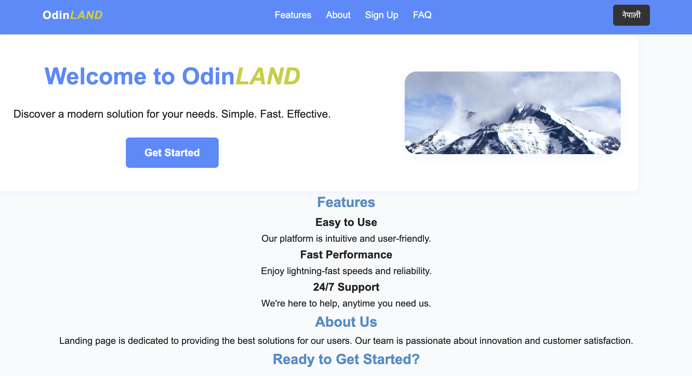

# Odin LAND - Bilingual Landing Page 🌍

Welcome to **Odin LAND**, a modern, responsive, and bilingual landing page built as part of The Odin Project curriculum. This project is designed to demonstrate HTML, CSS, and JavaScript fundamentals, while also providing support for **English** and **Nepali** languages.

## ✨ Features

- 🌐 **Bilingual Content** (English & Nepali)
- 📱 **Responsive Design** for all screen sizes
- ⚡ **Fast Loading** and smooth layout
- 🎨 Clean and modern user interface
- 🔀 Language toggle functionality (Client-side switcher)
- 📂 Separate About Page (`/pages/about.html`)

## 📸 Preview



# Project Live Demo

Here is the embedded live demo of my project:

[Live Demo](https://anasanrai.github.io/odin-landing-page/)


## 🛠️ Technologies Used

- HTML5
- CSS3

## 📁 Project Structure


## 🔄 Language Toggle

The site allows users to switch between English and Nepali instantly using the toggle button in the navigation bar. It uses `data-lang` attributes and simple JavaScript to control the visibility of content.

## 🚀 How to Use

1. Clone the repository:
   ```bash
   git clone https://github.com/anasanrai/odin-landing-project.git

## About the Project
This landing page was created as a part of learning frontend web development. It demonstrates how to build clean layouts, integrate multi-language support, and maintain semantic and accessible markup.

# 📃 License
This project is licensed under the MIT License.
MIT License

<!--Copyright (c) 2025 AnasanRai

Permission is hereby granted, free of charge, to any person obtaining a copy
of this software and associated documentation files (the "Software"), to deal
in the Software without restriction, including without limitation the rights
to use, copy, modify, merge, publish, distribute, sublicense, and/or sell
copies of the Software, and to permit persons to whom the Software is
furnished to do so, subject to the following conditions:

The above copyright notice and this permission notice shall be included in all
copies or substantial portions of the Software.

THE SOFTWARE IS PROVIDED "AS IS", WITHOUT WARRANTY OF ANY KIND, EXPRESS OR
IMPLIED, INCLUDING BUT NOT LIMITED TO THE WARRANTIES OF MERCHANTABILITY,
FITNESS FOR A PARTICULAR PURPOSE AND NONINFRINGEMENT. IN NO EVENT SHALL THE
AUTHORS OR COPYRIGHT HOLDERS BE LIABLE FOR ANY CLAIM, DAMAGES OR OTHER
LIABILITY, WHETHER IN AN ACTION OF CONTRACT, TORT OR OTHERWISE, ARISING FROM,
OUT OF OR IN CONNECTION WITH THE SOFTWARE OR THE USE OR OTHER DEALINGS IN THE
SOFTWARE.-->


## 🙌 Special Thanks
Thanks to The Odin Project for inspiring this learning journey!

